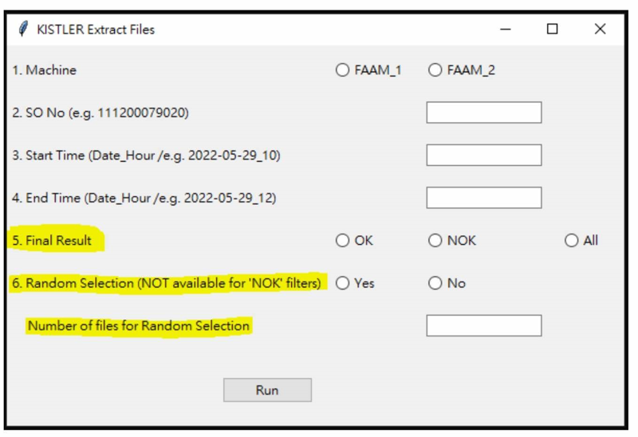
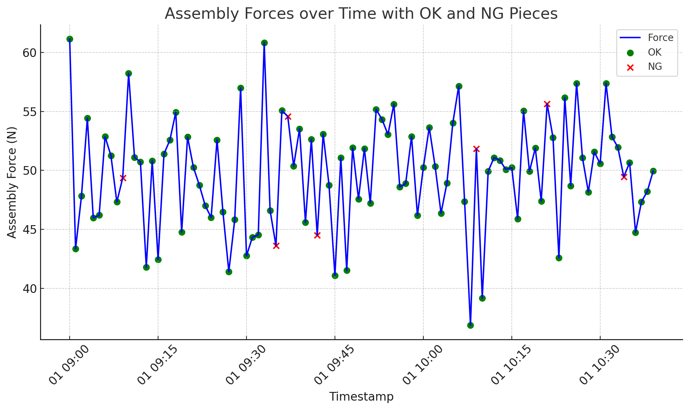

# KISTLER FAAM Machine Data Extraction GUI

## Project Overview

This project is a GUI tool that allows users to extract relevant data from multiple CSV files generated by KISTLER FAAM machines. Users can filter the data based on batch information, timestamps, and file contents, and visualize the data in the form of graphs.

## Features
- **Data Extraction**: Extracts data from batch folders for given time ranges and machine selections.
- **Filtering Options**: Choose between OK, NOK, or both results, with optional random sampling.
- **Graph Plotting**: Generate visual graphs for extracted data, with options for time intervals.
- **Save Output**: Exports extracted data and graphs to an Excel file with embedded images.

## GUI Screenshot

Here is a screenshot of the GUI used in this project:

### Assembly Force Plot

Below is a plot showing the assembly forces over time, highlighting OK and NG pieces:

## Setup

### Prerequisites
- Python 3.x
- Libraries:
  - `pandas`
  - `openpyxl`
  - `glob`
  - `os`
  - `time`
  - `plotnine`
  - `tkinter`

## Install required dependencies

- `pip install -r requirements.txt`

## Running the Application
To launch the GUI:
   - `python main.py`

## How to use

- **Select Machine**: Choose between FAAM_1 and FAAM_2.
- **Enter SO Number**: Provide the Sales Order (SO) number for batch extraction.
- **Select Time Range**: Specify the start and end time for data extraction.
- **Select Final Result**: Filter data based on OK, NOK, or both results.
- **Random Sampling**: Optionally, choose to sample random files from the extracted data.
- **Time Interval**: If random sampling is not used, choose the time interval for graph plotting.
- **Run**: Click the Run button to start the extraction process. The results will be saved in an Excel file with graphs.

### Author
Usama Yasir Khan
