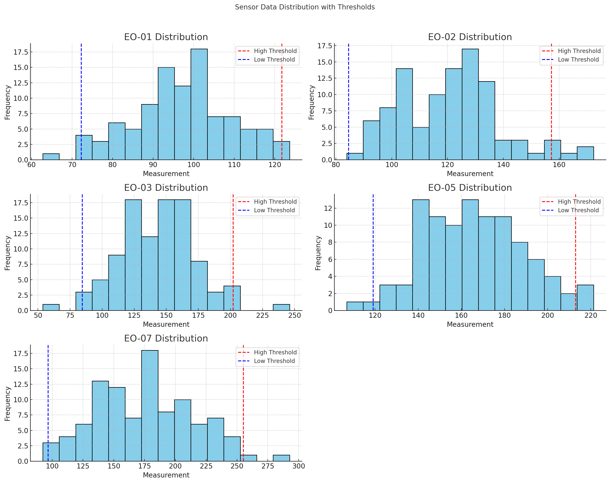
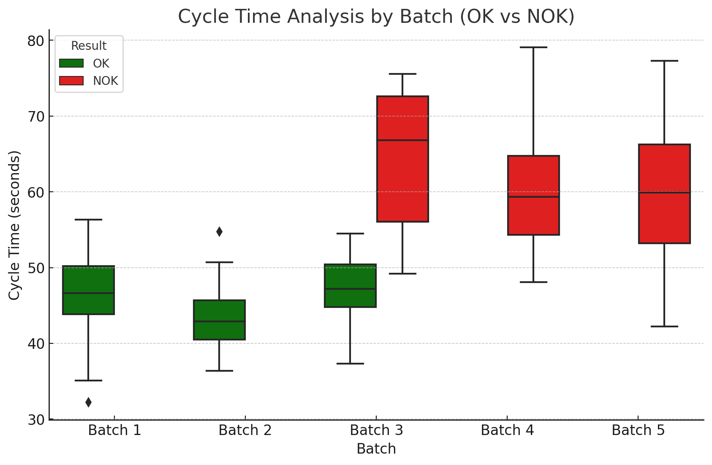

# KISTLER FAAM Machine Data Extraction GUI


## 📄 Project Overview

This project provides a GUI tool for extracting and analyzing data from CSV files generated by KISTLER FAAM machines. Users can filter the data based on batch details, time ranges, and file contents, and visualize the data through graphical plots.

## ✨ Key Features

- **Data Extraction**: Efficiently extracts data from batch folders within specified time ranges and machine selections.
- **Filtering Options**: Filter results by OK, NOK, or both, with an optional random sampling feature.
- **Graph Plotting**: Generate visual graphs of extracted data, with customizable time intervals.
- **Save Output**: Export extracted data and graphs to an Excel file with embedded images for easy sharing and reporting.

## 📊 Data Statistics

| Sensor  | Count | Mean   | Std. Dev | Min    | 25%    | 50%    | 75%    | Max    |
|---------|-------|--------|----------|--------|--------|--------|--------|--------|
| EO-01   | 100   | 98.44  | 13.62    | 60.70  | 90.99  | 98.10  | 106.09 | 127.78 |
| EO-02   | 100   | 120.45 | 19.07    | 81.62  | 103.89 | 121.68 | 130.76 | 174.40 |
| EO-03   | 100   | 141.62 | 27.11    | 58.97  | 123.61 | 142.44 | 157.61 | 236.32 |
| EO-05   | 100   | 163.21 | 26.52    | 96.28  | 142.99 | 161.50 | 180.52 | 225.69 |
| EO-07   | 100   | 178.04 | 37.23    | 99.43  | 148.79 | 177.34 | 202.80 | 287.76 |

### OK/NG Results Summary:
- **OK**: 80 pieces
- **NG**: 20 pieces

## 📊 Data Analysis

### 📈 Combined EO Sensor Data Distribution



This plot showcases the distributions of measurements for all EO sensors (EO-01, EO-02, EO-03, EO-05, EO-07) used in the FAAM machine for autoinjector assembly. Analyzing the data across all sensors provides a comprehensive view of their behavior, allowing quick identification of trends, deviations, and potential anomalies across the production line.

#### Key Insights

- **Normal Operating Range** 🎯: This distribution establishes baseline ranges for each sensor's measurements, helping to quickly identify deviations.
- **Threshold Markers** 🚦: High and low threshold lines (dashed) for each sensor denote the acceptable operational range. Values beyond these thresholds may signal potential outliers or abnormal behavior.
- **Anomaly Detection** 🛑: By viewing all sensors together, it’s easier to spot patterns or unusual values across multiple measurements, which could indicate emerging issues.

### 📊 Interpretation of Combined Sensor Plot

- **Cross-Sensor Analysis** 🔍: Analyzing all sensors in one plot enables systemic insight, allowing the detection of potential issues affecting multiple machine components.
- **Anomalies and Outliers** 📛: Values outside of threshold lines are flagged for review, supporting quality control and consistency within the assembly process.
- **Real-Time Monitoring** ⏱️: This plot can be updated in real-time to capture any sensor behavior shifts over time, supporting proactive maintenance and quality assurance.

This combined sensor view is essential for continuous monitoring of overall machine health, ensuring all EO sensors operate within expected ranges and facilitating quick detection of potential production line issues.

---

> **Note**: This section will serve as a valuable tool for quality assurance teams, maintenance staff, and engineers focused on ensuring the consistency and reliability of the FAAM machine’s operations.

## 📊 Cycle Time Analysis

**Goal:** Analyze cycle time variability across batches to assess process efficiency and identify bottlenecks.

**Implementation:** Calculate the average and variance in cycle times for each batch, focusing on key steps such as assembly, inspection, and packaging.

**Visualization:** The box plot below displays cycle times for various batches, color-coded by result (green for OK, red for NOK). This visual distinction allows for a quick assessment of cycle time distributions between acceptable and non-acceptable batches.



**Insights:**
- **Cycle Time Variation:** NOK batches exhibit higher cycle time variability, indicating potential inefficiencies or delays.
- **Process Efficiency:** OK batches generally show more consistent cycle times, which could be indicative of a streamlined process.
- **Bottlenecks:** By identifying batches with excessive cycle time variability, it may be possible to pinpoint steps in the production line that could benefit from process optimization.

This analysis provides a clear view of how cycle time impacts production quality, allowing for targeted improvements to enhance manufacturing efficiency and reduce downtime.

## 📷 GUI Screenshot

Below is a screenshot of the GUI used in this project:


### 📈 Assembly Force Plot

The following plot shows the assembly forces over time, distinguishing between OK and NG pieces:


## ⚙️ Setup

### Prerequisites

- **Python 3.x**
- Libraries:
  - `pandas`
  - `openpyxl`
  - `glob`
  - `os`
  - `time`
  - `plotnine`
  - `tkinter`

### Install Dependencies

To install required dependencies, run:
```bash
pip install -r requirements.txt
```

## 🚀 Running the Application
To launch the GUI:
   - `python main.py`

## 🛠️ How to Use

- **Select Machine**: Choose between FAAM_1 and FAAM_2.
- **Enter SO Number**: Provide the Sales Order (SO) number for batch extraction.
- **Select Time Range**: Specify the start and end time for data extraction.
- **Select Final Result**: Filter data based on OK, NOK, or both results.
- **Random Sampling**: Optionally, choose to sample random files from the extracted data.
- **Time Interval**: If random sampling is not used, choose the time interval for graph plotting.
- **Run**: Click the Run button to start the extraction process. The results will be saved in an Excel file with graphs.

### 👤 Author
Usama Yasir Khan
Manufacturing Engineer, Data Team  
Operation Excellence, Global Operations Engineering